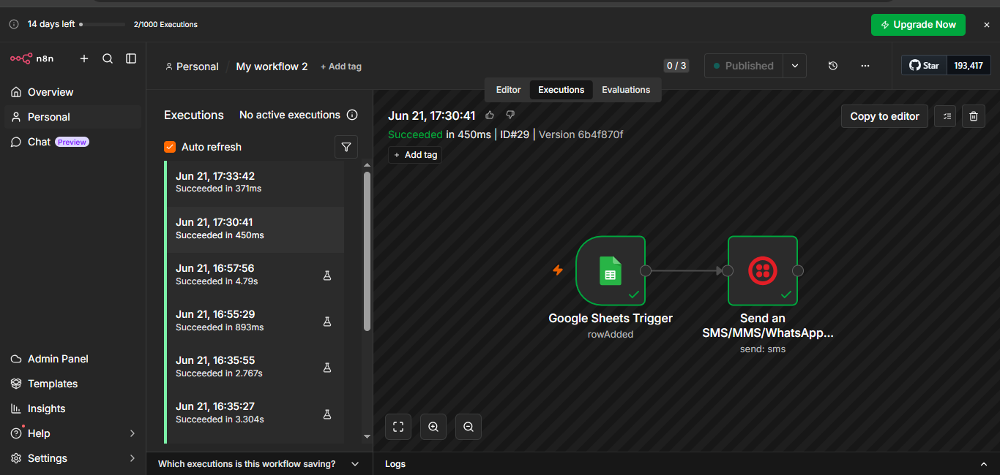
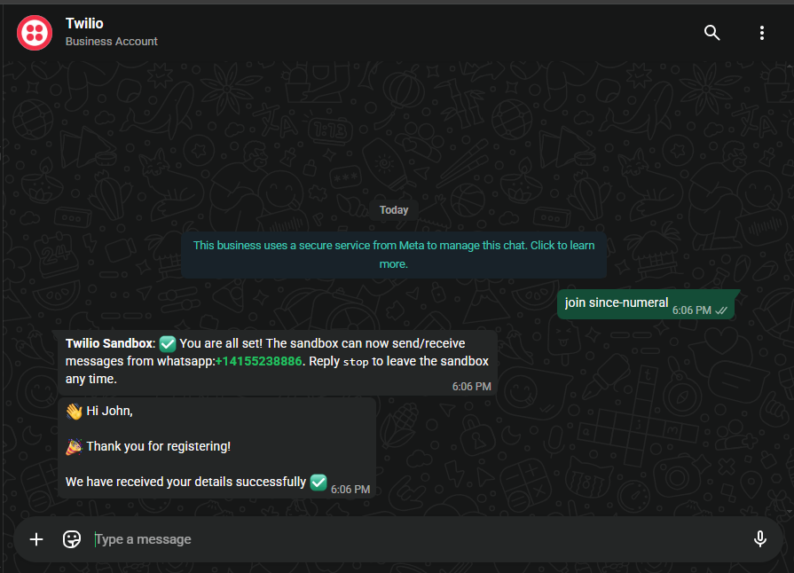

# 📲 WhatsApp Automation using n8n + Twilio + Google Forms

## 🚀 Overview

This project automates sending WhatsApp confirmation messages when a user submits a Google Form.

It showcases real-time workflow automation using APIs and integrations without heavy coding.

---

## ⚙️ How It Works

1. User fills the Google Form
2. Data is stored in Google Sheets
3. n8n detects a new row (trigger)
4. Twilio API sends a WhatsApp message automatically

---

## 🧩 Tech Stack

* 🔄 n8n (Workflow Automation)
* 📲 Twilio API (WhatsApp Messaging)
* 📊 Google Forms & Google Sheets
* ⚡ JavaScript Expressions (n8n)

---

## 💡 Features

* ✅ Real-time WhatsApp confirmation
* ✅ Fully automated workflow (no manual steps after setup)
* ✅ Dynamic message using user input
* ✅ Supports multiple users
* ✅ Simple and scalable design

---

## 💬 Sample Output

👋 Hi User,

🎉 Thank you for registering!
We have received your details successfully ✅

---

## ⚠️ Important Note

* This project uses **Twilio Sandbox**
* Users must join sandbox before receiving messages

### 📌 Steps to Join:

1. Save number: +14155238886
2. Send message: `join since-numeral`

---

## 📷 Demo

### 🔹 Workflow



### 🔹 WhatsApp Output



---

## 📁 Project Structure

```
whatsapp-automation-n8n/
│
├── README.md
├── workflow.json
└── images/
    ├── workflow.png
    └── whatsapp.png
```

---

## 🚀 Future Improvements

* 🤖 AI-based auto replies
* 📧 Email + WhatsApp integration
* 📊 Admin notification system

---
